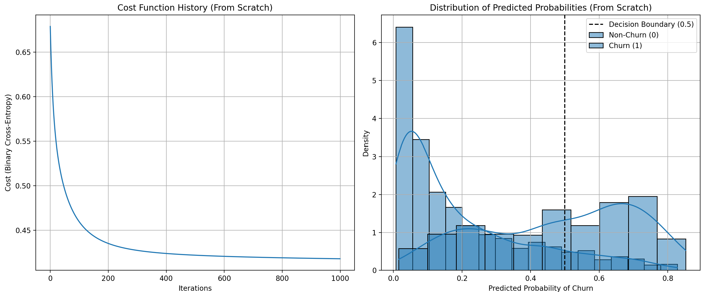
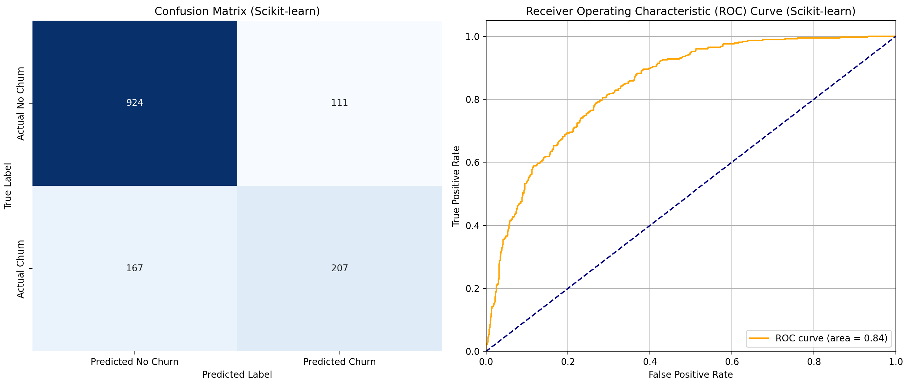

# **Logistic Regression on Telco Customer Churn Dataset**

This repository contains two Python scripts demonstrating **Logistic Regression** on the **Telco Customer Churn dataset**: one implemented **from scratch**, and the other using the `scikit-learn` library.

## **Problem Statement**

The primary goal of this project is to **predict customer churn** in a telecommunications company. By building the Logistic Regression models, we target to identify customers who are likely to discontinue their service, allowing the company to implement retention strategies. We compare a **custom-built Logistic Regression model from scratch** with a **Scikit-Learn library implementation**.

## **Results**

### 1. **Logistic Regression From Scratch (Using Gradient Descent)**

The Python script for this implementation is located at `logistic_regression_scratch.py`. Below are the plots showing the cost function's convergence and the distribution of predicted probabilities.

* **Accuracy:** `0.7949`

* **Precision:** `0.6421`

* **Recall:** `0.5134`

* **F1-Score:** `0.5706`

* **ROC AUC Score:** `0.8383`

**Confusion Matrix (From Scratch):**

[[928 107]
[182 192]]

* `True Negatives`: `928`

* `False Positives`: `107`

* `False Negatives`: `182`

* `True Positives`: `192`

### 2. **Logistic Regression with Scikit-learn**

The Python script for this implementation is located at `logistic_regression_sklearn.py`. Below are the plots showing the Confusion Matrix and the Receiver Operating Characteristic (ROC) Curve.

* **Accuracy:** `0.8027`

* **Precision:** `0.6509`

* **Recall:** `0.5535`

* **F1-Score:** `0.5983`

* **ROC AUC Score:** `0.8426`

**Confusion Matrix (Scikit-learn):**
[[924 111]
[167 207]]

* `True Negatives`: `924`

* `False Positives`: `111`

* `False Negatives`: `167`

* `True Positives`: `207`

## **Conclusion**

Both implementations achieved **comparable results** for predicting customer churn, with the `scikit-learn` model showing slightly better performance across most metrics.
